# Git & GitLab Practical Assignment

## Student Details

* **Name:** Mahesh Suryavanshi
* **Batch:** 8 Nov 2025
* **Course:** MCA

---

## Task 1: Create a GitHub Repository

Created a public GitHub repository named **git-practice-task** and initialized it with a README file.

### Screenshot

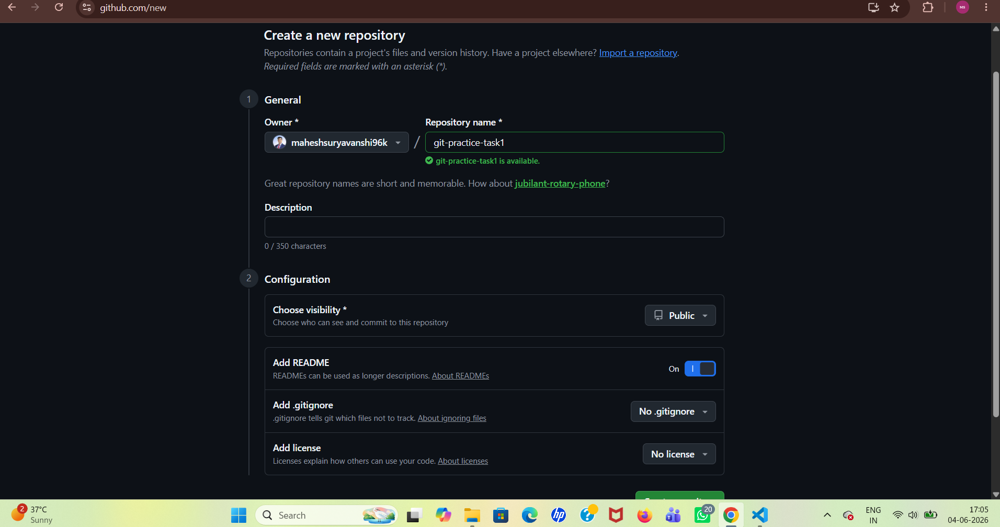

---

## Task 2: Clone the Repository

Cloned the repository to the local machine and verified the clone successfully.

### Screenshot

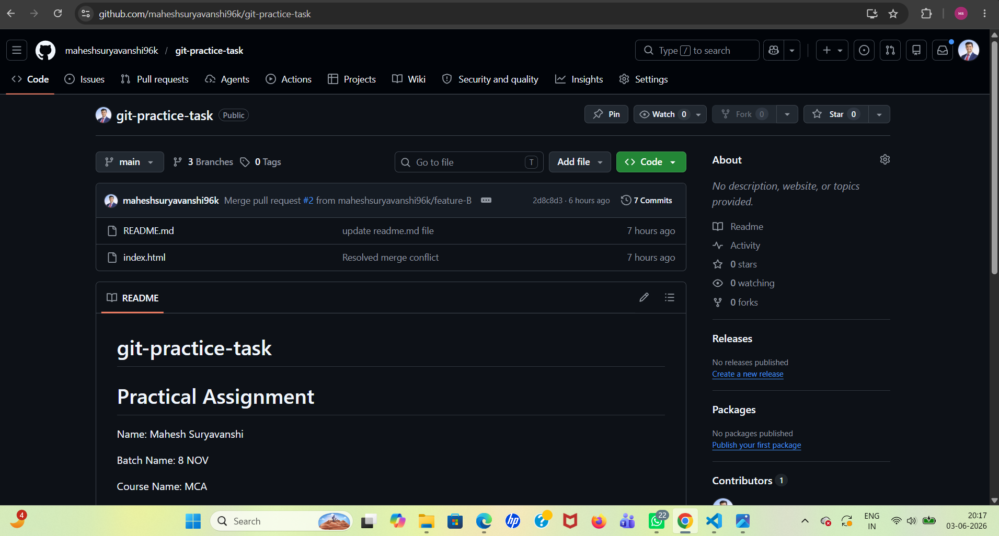

---

## Task 3: Initial Development on Main Branch

Updated the README file with student and assignment details. Committed and pushed the changes to GitHub.

### Screenshot

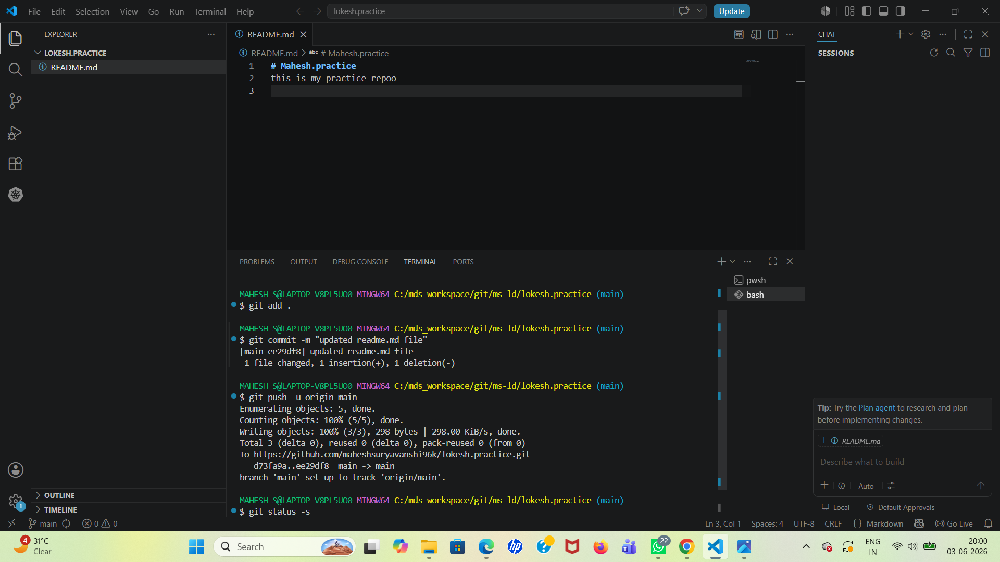

---

## Task 4: Create Feature-A Branch

Created a new branch named **feature-A**, added an **index.html** file with sample HTML content, committed and pushed the changes.

### Screenshot

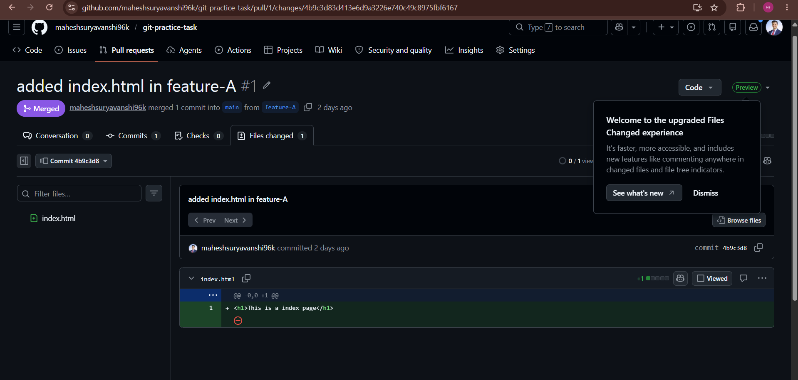


---

## Task 5: Create Pull Request

Created a Pull Request from **feature-A** to **main** branch.

### Screenshot

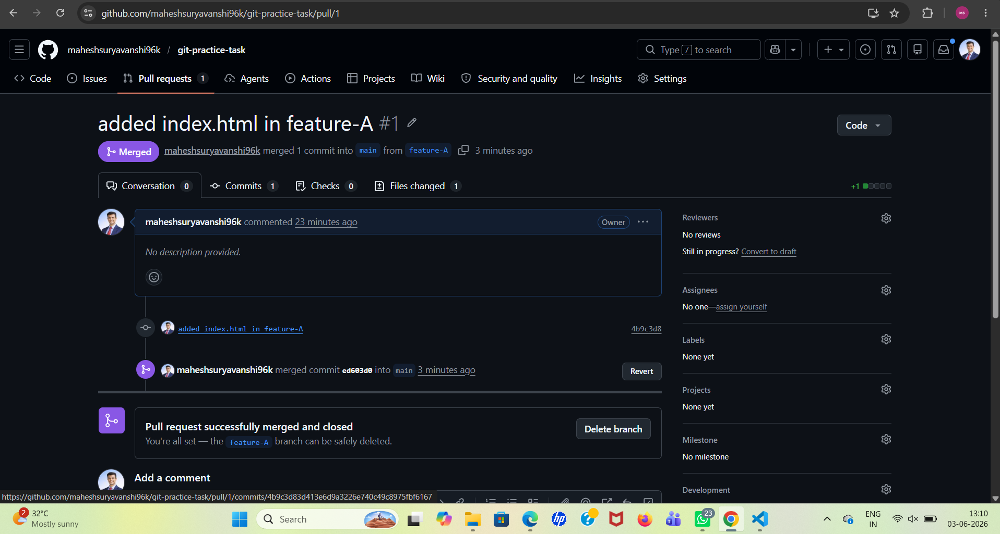

---

## Task 6: Create Feature-B Branch

Created a new branch named **feature-B**, modified the existing **index.html** file, committed and pushed the changes. Created a Pull Request.

### Screenshot

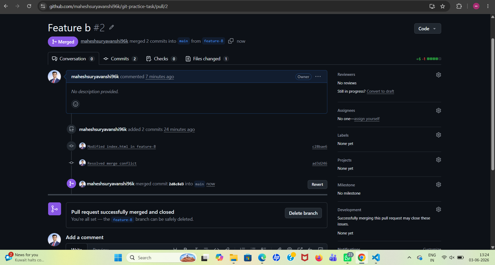

---

## Task 7: Merge Feature-A

Reviewed and merged the Pull Request from **feature-A** into the **main** branch.

### Screenshot


---

## Task 8: Handle Merge Conflict

Pulled the latest code from the main branch, resolved the merge conflict manually, committed the resolved code, and pushed the changes.

### Screenshot

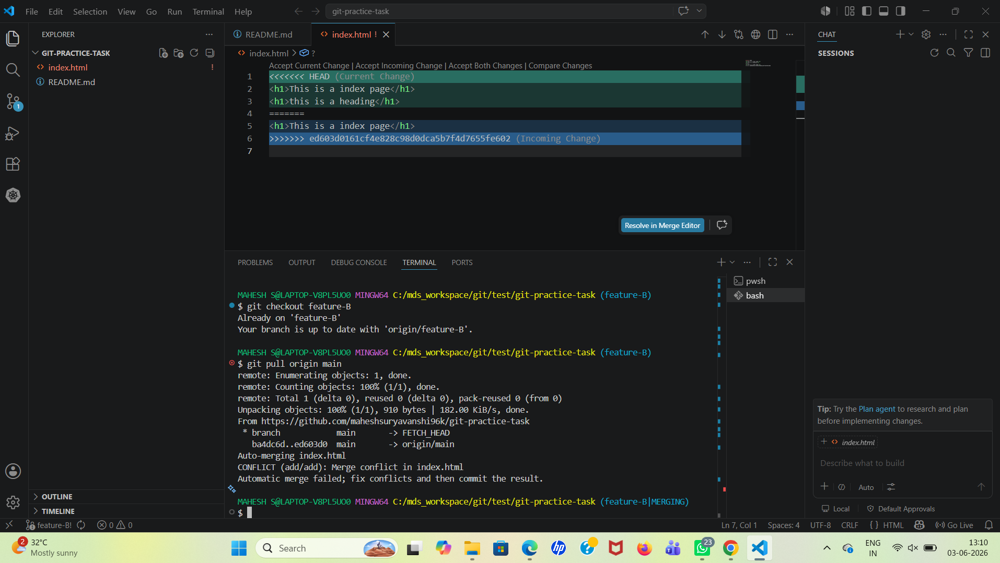

---

## Task 9: Complete the Merge

Merged the **feature-B** Pull Request and verified all changes in the main branch.

### Screenshot

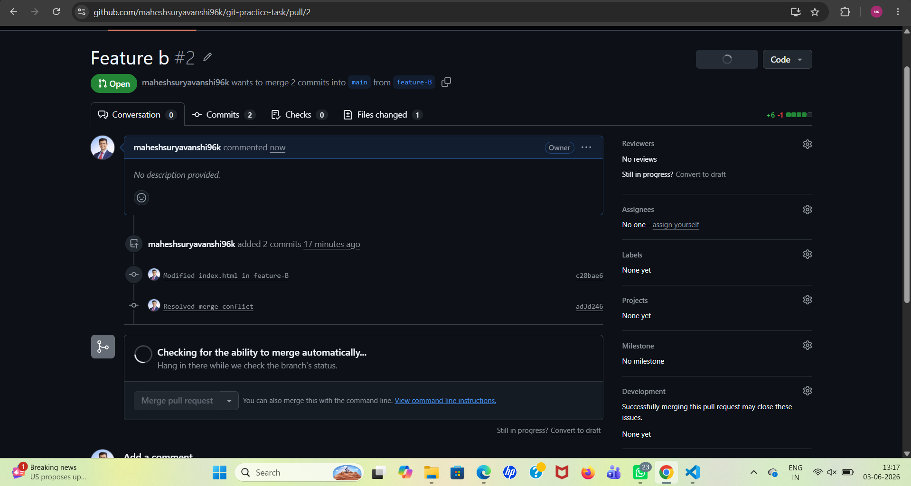

---

## Task 10: Fork and Contribute

Forked a public GitHub repository, cloned it locally, updated the README file, pushed changes to the fork, and created a Pull Request.

### Screenshot

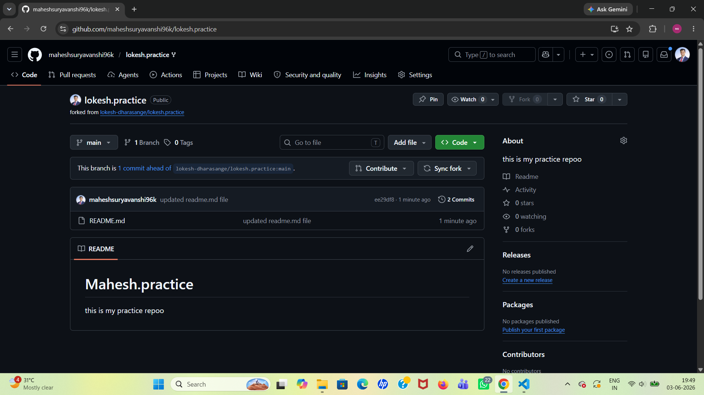

---

## Task 11: GitLab Repository Setup

Created a private GitLab repository, cloned it using SSH, created the required project structure, committed, and pushed the files.

### Project Structure

```text
project/
├── src/
│   └── app.py
├── docs/
│   └── guide.md
└── README.md
```

### Screenshot

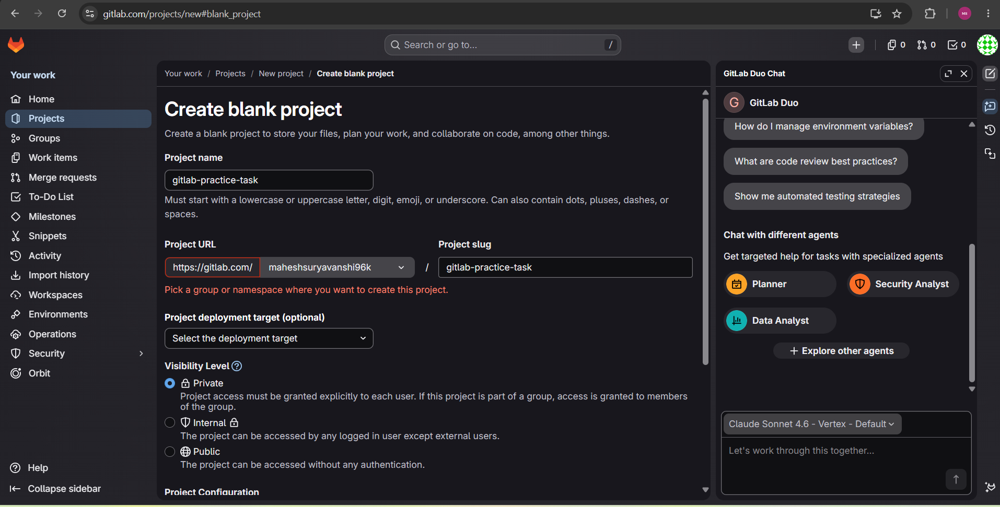


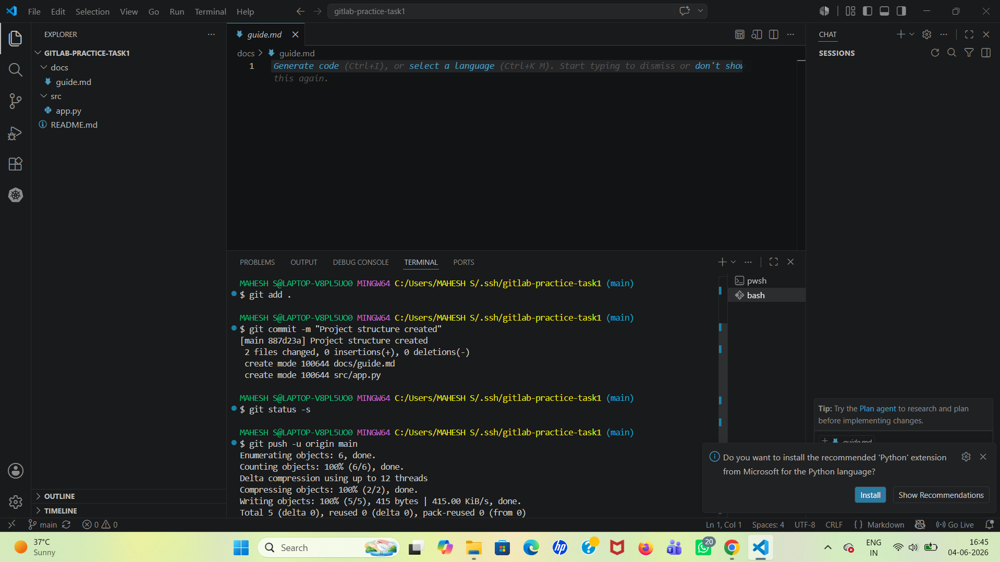


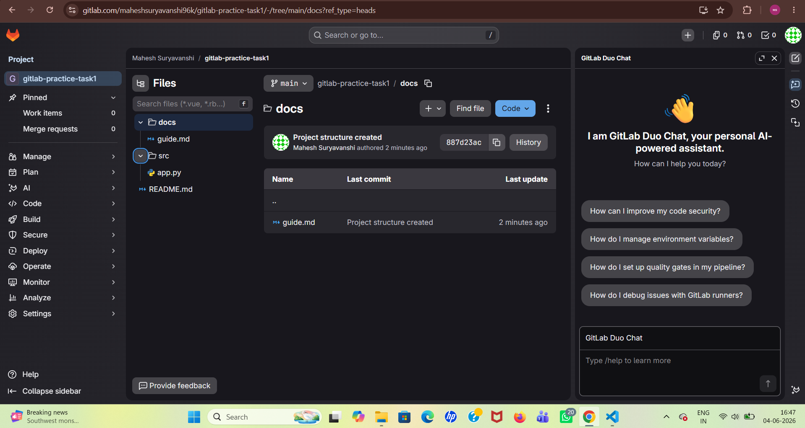

---

## Task 12: Repository Mirroring

Configured repository mirroring between GitLab and GitHub. Verified that changes pushed to GitLab automatically appeared in GitHub.

### Screenshot

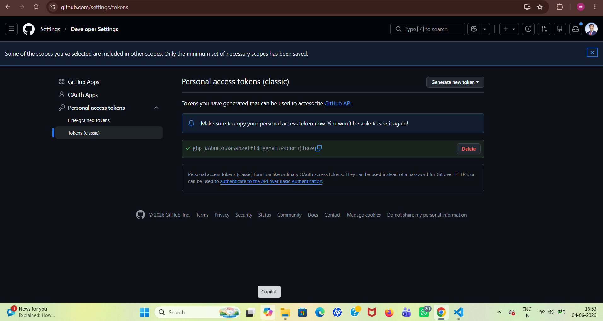

[Task 12](Screenshots/task-12.png)

---

## Task 13: Branch Protection

Configured branch protection rules on the **main** branch to prevent direct pushes and allow changes only through Pull Requests.

### Screenshot

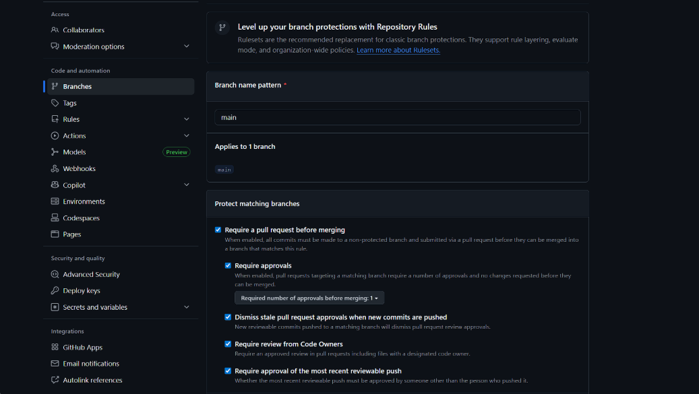

---

## Task 14: Final Verification

### Completed Tasks

* ✅ GitHub repository created
* ✅ Repository cloned locally
* ✅ Feature branches created
* ✅ Pull Requests created and merged
* ✅ Merge conflict resolved
* ✅ Fork created and updated
* ✅ GitLab repository configured
* ✅ Repository mirroring working
* ✅ Branch protection enabled


---

## Repository URLs

### GitHub Repository

https://github.com/maheshsuryavanshi96k/git-practice-task

### GitLab Repository

https://gitlab.com/maheshsuryavanshi96k/gitlab-practice-task1

---

## Conclusion

This assignment helped in understanding Git and GitLab workflows including repository creation, cloning, branching strategy, pull requests, merge conflict resolution, repository mirroring, fork workflow, and branch protection rules.
